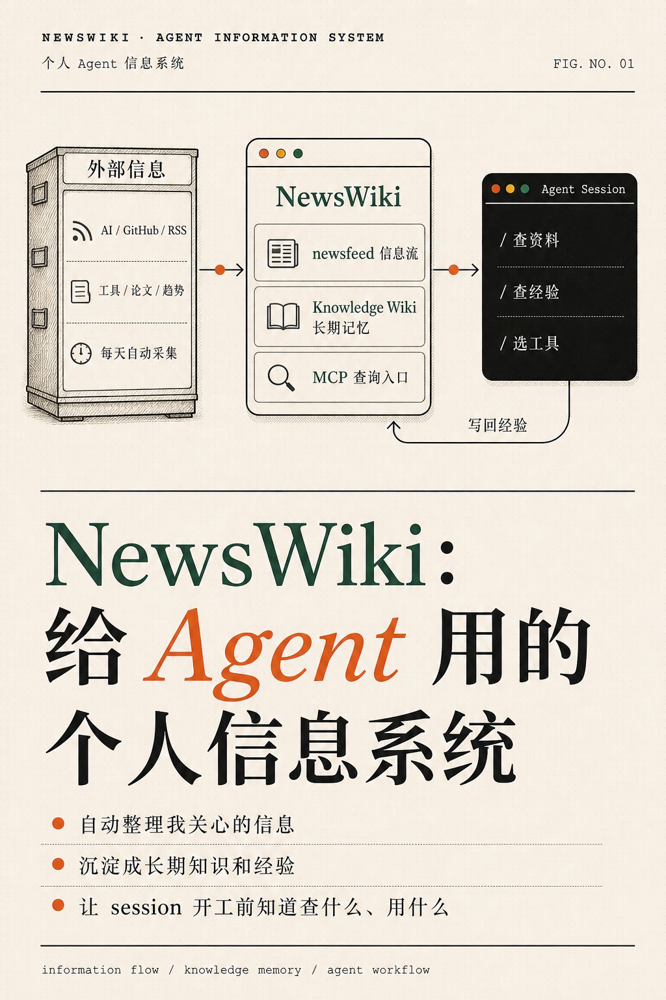
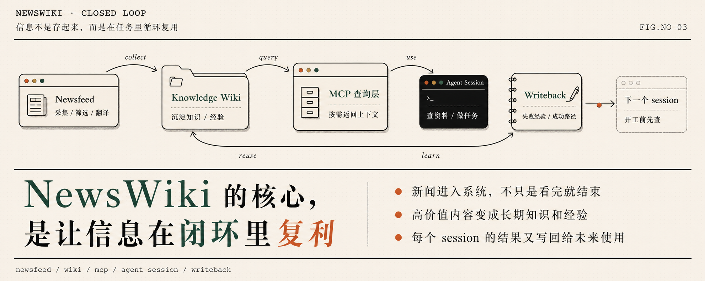
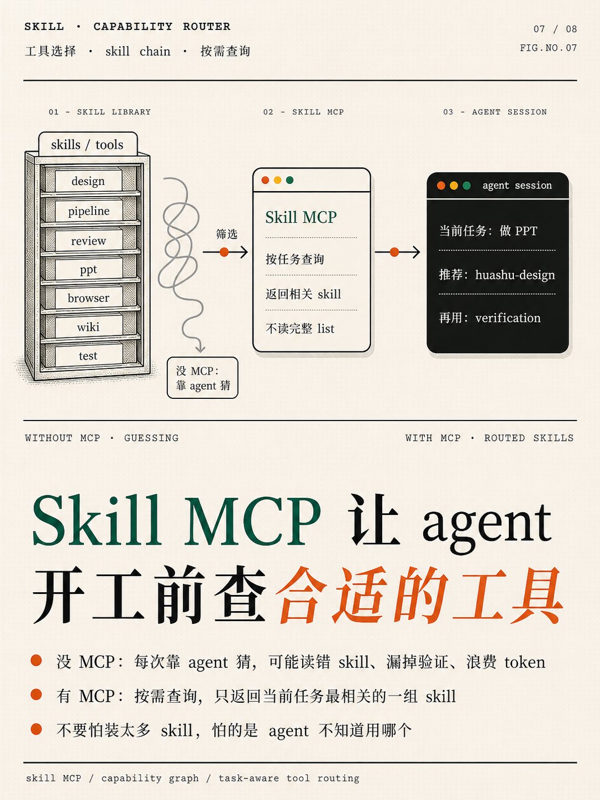

# Newswiki

Newswiki 是一个本地优先的个人 Agent 信息系统模板，也包含一个 hosted MCP alpha 骨架。



它解决的不是“怎么做一个新闻网站”，而是：当你的 Agent 开始做一件事之前，怎样先知道三类上下文：

1. 我能用什么工具？ -> Capability MCP
2. 我以前知道什么？ -> Wiki MCP
3. 最近发生了什么？ -> Newsfeed MCP

很多人都会做信息源、知识库、网页展示。Newswiki 的核心是 **开工前上下文协议**：让 Agent 在规划和执行之前，先查询能力、长期记忆和近期信息。

## Hosted Alpha

这个 repo 现在也包含一条公开安全的 hosted alpha 路径：

- public-safe export schema 和 validator
- 只读 REST API
- hosted MCP adapter
- 真实 stdio MCP smoke client
- 静态 context-pack playground

完整跑通步骤见：[Hosted Alpha 快速开始](docs/quickstart-hosted-alpha.md)。

默认只使用假数据。它是产品骨架，不是托管账号系统，也不是你的私人数据后端。

关于“开源自建”和“商业 hosted service”的关系，见：[开源模板与 Hosted Service](docs/open-core.zh-CN.md)。

## 三个核心 MCP



### Wiki MCP

Wiki MCP 把你的私人 Markdown 知识库暴露给 Agent 查询和写回。

它适合存：

- 长期决策
- 可复用模式
- 项目经验
- 已知坑
- 未解决问题
- 主题页面

这个设计受到 Andrej Karpathy 的 LLM Wiki 思路启发，也参考了相关公开实现：

- [karpathy/llm-wiki.md](https://gist.github.com/karpathy/442a6bf555914893e9891c11519de94f)
- [Pratiyush/llm-wiki](https://github.com/Pratiyush/llm-wiki)

### Capability MCP



Capability MCP 用来回答：“这个 Agent 当前能用什么？”

它读取由扫描脚本生成的本地能力目录，包括：

- skills
- plugins
- MCP servers
- CLI tools
- automations
- project workflows

Agent 可以在开工前查询推荐能力链，避免靠猜。

### Newsfeed MCP

Newsfeed MCP 用来回答：“最近有什么相关信息？”

它可以暴露：

- 最新文章
- 来源健康状态
- 趋势摘要
- 候选 Wiki 条目
- pipeline 运行报告

默认应该是只读的。它的作用是给 Agent 提供近期上下文，而不是把整个新闻流塞进 prompt。

## 可选模块

Newswiki 的核心是三 MCP，不是某个固定供应商或固定前端。

这些都可以替换：

- 信息源：RSS、URL、手动 inbox、AgentSearch、浏览器自动化
- LLM：Qwen、OpenAI、Anthropic、Gemini、本地模型
- 处理方式：API 自动处理，或直接让 Agent session 批处理
- 长文评估：NotebookLM，可选
- 展示层：本地 localhost 或 Vercel 上的 Web UI，可选

### 为什么示例里提到 Qwen？

因为 Qwen 做中文分类、摘要、翻译的性价比很好，中文能力强，token 成本也低。

但它不是必要组件。你可以换成任何 LLM provider，也可以先跳过 API 集成，直接用 Agent automation session 处理。

### 为什么提到 NotebookLM？

NotebookLM 也不是必要组件。

使用它的理由通常是：

- 长网页抓取和阅读
- 对文章做深度评估
- 复用浏览器/session
- 节省 LLM token

如果你的信息源很简单，可以完全不用它。

## 快速开始

```powershell
git clone https://github.com/YOUR_USER/Newswiki.git
cd Newswiki
python -m venv .venv
.\.venv\Scripts\Activate.ps1
pip install -r requirements.txt
.\scripts\init_newswiki.ps1 -Target "$HOME\Newswiki-private"
```

初始化后，你会得到一个私有实例：

```text
Newswiki-private/
  AGENTS.md
  capabilities.json
  config/
  data/news/
  wiki/
  raw/
  reports/
  state/
```

这个私有实例不要公开。

## 文档入口

- [快速开始](docs/quickstart.md)
- [Agent 自动搭建协议](docs/agent-setup-protocol.md)
- [Agent 搭建检查清单](docs/agent-checklist.md)
- [Hosted Alpha 快速开始](docs/quickstart-hosted-alpha.md)
- [MCP Client 配置](docs/mcp-client-setup.md)
- [开源模板与 Hosted Service](docs/open-core.zh-CN.md)
- [产品测试计划](docs/testing-plan.md)
- [Claude Code 测试脚本](docs/claude-code-test.md)
- [自己搭一套 Newswiki](docs/build-your-own.md)
- [三个核心 MCP](docs/core-mcps.md)
- [系统图](docs/system-diagram.md)
- [隐私边界](docs/privacy.md)
- [参考项目](docs/references.md)
- [公开发布清单](docs/public-release-checklist.md)

## 仓库结构

```text
mcp/
  wiki/           Wiki MCP 模板
  capabilities/   Capability MCP 模板
  newsfeed/       Newsfeed MCP 模板

templates/
  wiki/           私有 Knowledge Wiki 骨架
  config/         配置模板
  agents/         Agent 启动协议模板

pipeline/         可选的信息采集、处理、存储、报告骨架
connectors/       可选集成：NotebookLM、AgentSearch、浏览器自动化
service/          hosted alpha REST / MCP 服务骨架
web/              可选静态 playground / Web UI 骨架
examples/         公开安全的假数据
scripts/          初始化、能力扫描、隐私扫描脚本
newswiki.setup.json  给 AI agent 读取的机器可读搭建 manifest
```

Agent 自动搭建入口：

```bash
python scripts/agent_setup_newswiki.py --target ~/Newswiki-private
```

## 隐私规则

公开 repo 只能放：

- 文档
- 模板
- 假数据
- 骨架代码
- provider-neutral 的教程

永远不要提交：

- 真实文章
- 真实 source 列表
- 私人 wiki 页面
- 浏览器 session
- API key
- token
- database
- pipeline 运行结果
- NotebookLM 状态
- Vercel project id

提交前运行：

```powershell
python scripts\privacy_scan.py
```

扫描不是绝对保证。公开前仍然要人工检查 diff。

## 一句话

Newswiki 是一个 MCP-first 的个人 Agent 信息系统模板。

它让 Agent 在开工前先知道：

- 我会什么
- 我记得什么
- 最近发生了什么

然后再开始工作。
