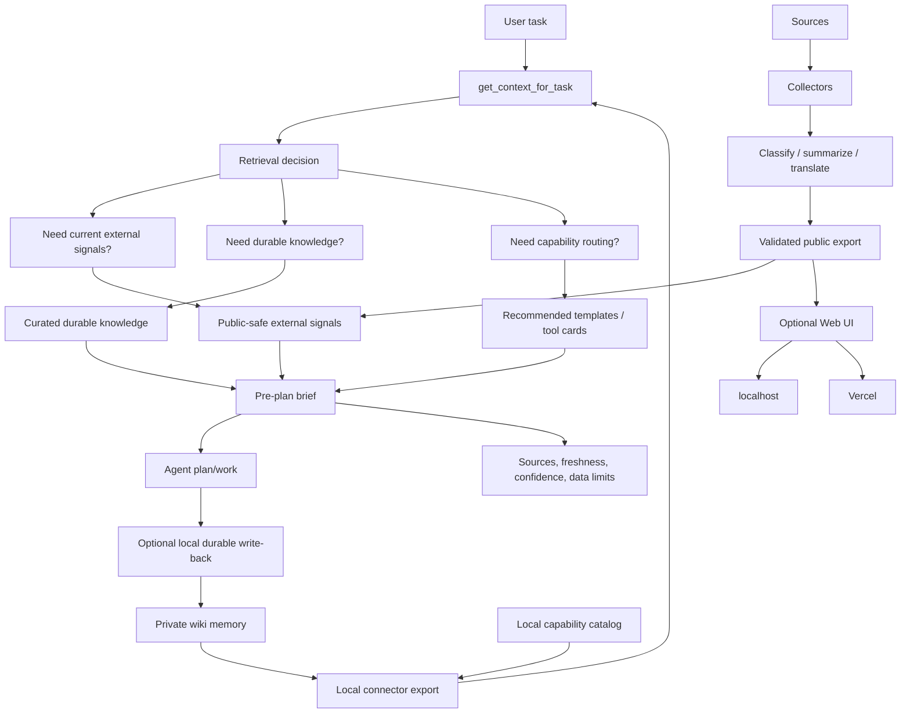

# System Diagram

Newswiki is a source-backed pre-plan context system for coding agents.



## What Is Core

- `get_context_for_task`
- source-backed pre-plan brief
- retrieval decision metadata
- public-safe export validation
- freshness, confidence, and data-limit disclosure

## What Is Input Layer

- Newsfeed/current signal exports
- curated public knowledge
- private wiki connector exports in local mode
- local capability connector exports in local mode
- recommended tool/template cards

## What Is Replaceable

- source collectors
- LLM provider
- NotebookLM
- AgentSearch
- browser automation
- web UI
- Vercel

## Privacy Boundary

```text
Hosted/default mode:
  validated public-safe exports only

Local/self-hosted mode:
  optional private wiki and local capability connector exports

Private instance:
  real wiki, real sources, real news, sessions, reports, state, databases
```
