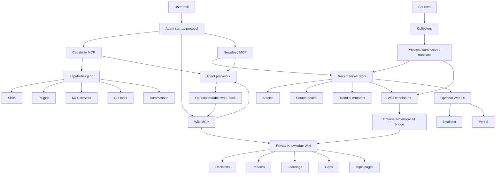

# System Diagram

Newswiki is a local-first agent information system.



## What Is Core

- Capability MCP
- Wiki MCP
- Newsfeed MCP
- startup protocol

## What Is Replaceable

- source collectors
- LLM provider
- NotebookLM
- AgentSearch
- browser automation
- web UI
- Vercel

## Privacy Boundary

```text
Public repo:
  docs, templates, fake examples, skeleton code

Private instance:
  real wiki, real sources, real news, sessions, reports, state, databases
```
